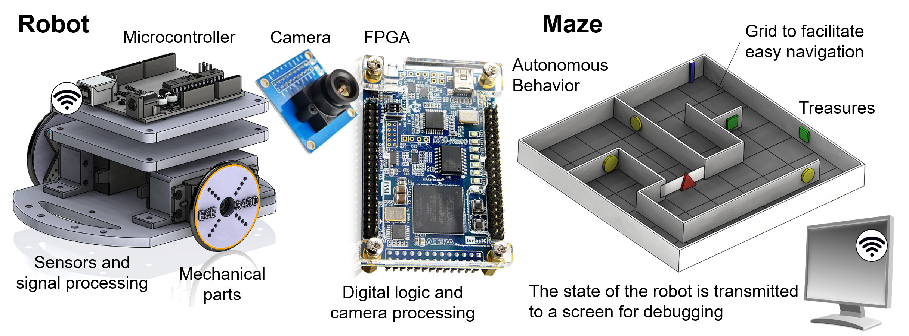

# ECE 3400 Intelligent Physical Systems

## Cornell University, Fall 2018

* [Instructor](./instructors.md): Assistant Professor Kirstin Petersen (khp37)
* [TA's](./instructors.md)
* [Piazza](https://piazza.com/cornell/fall2018/ece3400/home?), sign up [here](http://piazza.com/cornell/fall2018/ece3400)
* Note that lab and milestone grades will be distributed over Blackboard!
* Class hours: Monday and Wednesday 11.15am-12.05pm, Upson Hall 142 (or overflow rooms).
* Team meetings: Friday 11.15am-12.05pm, Upson Hall 142 (or overflow rooms).
* Labs: Monday 1.25-4.25pm, Monday 7.30-10.30pm, Wednesday 7.30-10.30pm, Thursday 7.30-10.30pm, Friday 1.25-4.25pm in Phillips Hall 427. 

***

Welcome to ECE 3400; a class where students learn to tie the fundamental principles of Electrical and Computer Engineering (ECE) across virtual and physical boundaries to create autonomous robots able to perceive, reason about, and act upon their environment. Specifically, in teams of 4-5, students will design and fabricate a robot able to navigate and map out a maze with treasures in the shortest possible time.

[Here is a video of the 2015 competition](https://www.youtube.com/watch?v=WN0maCOflVQ).

Instead of traditional hand-ins, we leverage peer-to-peer mentoring where students, under guidance, upload their progress and ideas to create a sustainable and continuously evolving database for future students to rely on.

***

## Relevant Links

* [Course Description](./courseDescription.md)
* [Detailed Schedule](schedule.md)
* [Lab schedule](https://calendar.google.com/calendar/b/1?cid=ZWNlMzQwMDIwMTdAZ21haWwuY29t)
* [Lectures](./lectures/readme.md)
* [Piazza](https://piazza.com/cornell/fall2018/ece3400/home), please sign up [here](https://piazza.com/cornell/fall2018/ece3400)
* [Team Websites](./teams.md)
* [Grades, rules, and final scoring chart](./Grading/Readme.md)
* [Robot cost](./Cost.md)
* [Tutorials](./tutorials/readme.md)

***

## Schedule and Hand-Outs

Please be aware that the following schedule is tentative and may change throughout the semester.

Week | Topic | Week | Topic
-----|-------|------|-------
1 | Intro | 9 | Prototyping [_LAB 4_](./lab4.md)  
2 | Embedded programming, team work/time management, [_LAB 1_](./lab1.md) | 10 | Conflict resolution and algorithms 
3 | Online communication | 11 | Algorithms, [_Milestone 3_](./Grading/Milestone_score.md) 
4 | Sensors and filters [_Milestone 1_](./Grading/Milestone_score.md) | 12 | Evaluating and debugging IPS
5 | Actuators and control, [_LAB 2_](./lab2.md) | 13 | (EE-)Power and Careers, [_Milestone 4_](./Grading/Milestone_score.md)
6 | Wired/wireless communication | 14 | Alternative approaches to IPS 
7 | FPGA/Vision, [_LAB 3_](./lab3.md) | 15 | IPS Ethics 
8 | Prototyping, [_Milestone 2_](./Grading/Milestone_score.md) | 16 | Final Competition

See detailed schedule and deadlines [here](schedule.md)

***
