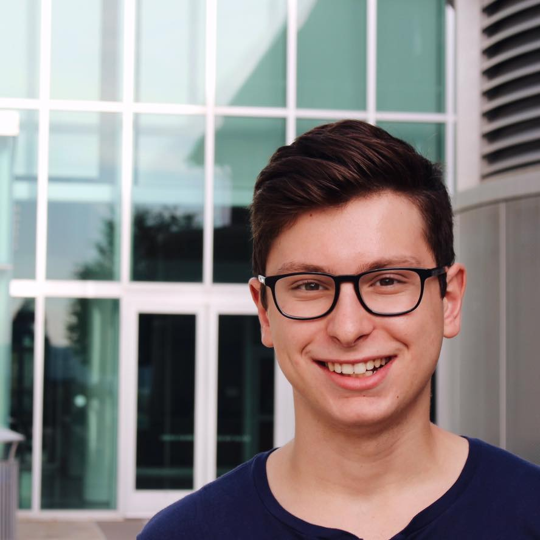

# ECE 3400: Intelligent Physical Systems
## Cornell University, Fall 2018

[Return to main page](https://cei-lab.github.io/ece3400-2018/)

If you have a question that can't be answered by one of the links above, or on the Piazza page, try contact one of us!

### Instructor: Kirstin Petersen

I am an assistant professor in ECE, with field appointments in ME and CS. I run the [Collective Embodied Intelligence Lab](http://cei.ece.cornell.edu/) with research on bio-inspired robot collectives. Feel free to contact me with any questions/concerns that don't fit Piazza. I have no specific office hours, but I intend to hang around PH427 in the beginning of many of the lab sessions. When I'm not designing random robots, I'm all about hiking, kayaking, camping, and getting as far from my computer as possible!

### TA: Haron Abdel-Raziq (lab session: )

### TA: Ryan O'Hern (lab session: )

I am a second-year PhD student in ECE, working with Kirstin in the [Collective Embodied Intelligence Lab](http://cei.ece.cornell.edu/). I am a computer scientist by training, but a passion for building things brought me into ECE and robotics. You can ask me a question about any topic taught in the course. Outside of the lab I can be seen deadlifting in Teagle or on the mats with the Cornell Brazilian Jiu Jitsu Club.

### TA: Thinesiya Krishnathasan (lab session: )

### TA: Alicia Coto (lab session: )

### TA: Jennifer Fuhrer (lab session: )

### TA: Logan Horowitz (lab session: )

I'm a senior ECE currently involved in a number of projects with the Collective Embodied Intelligence Lab, designing electronics for studying bees and creating modular robots.  I am also conducting research with the Molnar Group, designing circuit blocks for use on various IC’s and exploring novel energy recovery methods to improve full-duplex radio efficiency.  I am the electrical lead for Resistance Racing: Cornell Electric Vehicles.  I love wrestling, biking, and climbing trees or buildings.

### TA: Alex Katz

### TA: Evan Kravitz (lab session: Monday 7:30-10pm)

I'm a fourth year undergrad studying ECE with a minor in CS. My interests include computer software/hardware, math, physics, and data science. I do research in the CSL under Prof. Zhiru Zhang, working on a developing efficient machine learning algorithms that can be executed on GPUs and FPGAs. I like to bike, run, hike, and eat good food. 

### TA: Yonghun Lee

### TA: Michael Solomentsev (lab session: )

