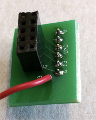
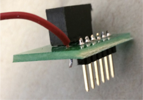

# Lab 3: System Integration and Radio Communication
## ECE 3400 Fall ’18

### Objective
In this lab you will integrate the components you have worked on in Labs and milestones 1 and 2. You will make a robot that can start on a 660Hz tone, have it navigate a small test maze autonomously, and have it send the maze information it discovers wirelessly to a base station. The base station, in turn, will display these updates on a screen for debugging. 

Before the lab, split your team into two groups. One group will work on the radio component and the other on integrating robot start signals, line following, wall detection and detection of other robots (while ignoring decoys). For the final portion of the lab, your work will be tied together so that the robot can run through the maze and update the program as it goes. 

### Documentation
Throughout this lab and ALL labs, remember to document your progress on your website. Add anything that you think might be useful to the next person doing the lab. This may include helpful notes, code, schematics, diagrams, videos, and documentation of results and challenges of this lab. You will be graded on the thoroughness and readability of these websites.

Remember, all labs are mandatory; attendance will be taken at every lab. All labs will require you to split into two sub-teams, so be sure to note on the website what work is carried out by whom.

### Joint Pre-Lab
Before you come to lab, you need to discuss with your entire team how you want to encode the maze and all the information in the maze. Preferably, whatever you do for the small test setup in this lab, will apply directly to the big maze in the final challenge. We have gone over some of these principles in lectures. Remember, the final maze will have 9x9 squares. Each square can be explored/unexplored, have walls on either and all sides, have treasures (with three shapes/colors) or not, and potentially have other robots/decoys as well. Will all this information fit in the memory of the Arduino? (How much SRAM do you have available?) Consider using bit masking to compress information. 

***

## Radio Group
To know if the robot is correctly searching through the maze, it will have to display the map it has discovered on a screen connected to a base station which is wirelessly connected to your robot. Beyond this application, the radio itself will come in handy for debugging purposes because it just acts as a (wireless) serial link between two Arduinos, one of which is hooked up to your computer.  

### Materials
- 2 Nordic nRF24L01+ transceivers
- 2 Arduino Unos (you can borrow an extra one *for the duration of the lab session* from the TAs)
- 2 radio breakout boards with headers (if we are out, feel free to make your own from perfboards).




### Extra Pre-lab Assignment

This lab will use the RF24 Arduino library. Before you start the lab, look over the reference page (http://maniacbug.github.io/RF24/classRF24.html) and review the primary public interface methods at the top of the page. Make sure that you understand what they do at a high level.

You will also use the graphical user interface (GUI) prepared by the TAs. To install this GUI, please follow the instructions [here](https://github.com/backhous/ece3400-maze-gui). 

### Procedure
**Getting Started**

Plug your radios into your Arduinos using the special printed circuit boards. Wire the radio to the 3.3V pin on the Arduino.


Download the [RF24 Arduino library](https://github.com/maniacbug/RF24). Add it to the Libraries folder in your Arduino directory. *Note:* Do not update this library if the Arduino asks you to do so. The update will break the example code used for this lab.

Download the "Getting Started" sketch from the course GitHub repository for Lab 4. Do NOT use the "Getting Started" sketch included in the RF24 library. Replace the Getting Started code in the RF24 library example folder with the one you downloaded from the course GitHub.

Change the identifier numbers for the two pipes to the ones assigned to your team using the following formula:

```
2(3D + N) + X
```

where D is the day of your lab (0 = Monday day, 1 = Monday night, 2 = Wednesday night, 3 = Friday) and N is your team number. X is 0 for one radio and 1 for the other (you need 2 identifiers, which is why this X is included in the formula).

Example: You are Friday Team 9. And so, D = 3, N = 9, and your identifier numbers are then:

2*(3*3 + 9) + 0/1 = 36 and 37 in decimal = 24 and 25 in hex.

You will put these channel numbers (with leading 0s) in the line of code that says

```C
const uint64_t pipes[2] = { 0xF0F0F0F0E1LL, 0xF0F0F0F0D2LL };
```

so that it instead says

```C
const uint64_t pipes[2] = { 0x0000000024LL, 0x0000000025LL };
```

The LL’s mean “long long,” or a 64-bit number. Leave these in.

Program the sketch onto *both* of your Arduinos. If you like, you can use two PC's, one for each Arduino, so that you can open a serial monitor for each simultaneously. Otherwise, you can use a single PC and switch the serial monitor between the two.

Choose one Arduino to be the transmitter and open the serial monitor for it. Type in “T” and hit enter. This will put it in Transmit mode. You should see this Arduino sending a timestamp. Switch to the serial monitor for the other Arduino and you should see it printing the received message.

Once this is working, do some quick experiments with range and channel number. How far do the radios work at the chosen power level? Do you have any dropped packets? Is there any interference?

*Note:* If you wish to try different power levels, note that the commented values are INCORRECT. The enum names are “RF24_PA_MIN, RF24_PA_LOW, RF24_PA_HIGH, and RF24_PA_MAX.” There is no MED value that the code mentions.

Make sure you understand the "Getting Started" sketch at a high level; it is suggested that you use this sketch as a building block for your own radio code. If you have any questions, ask a TA.

**Sending Maze Information Between Arduinos**

In the final challenge the GUI will sound the 660Hz signal that starts your robot, and then log and display all the information sent to it by your robot through your base station. After 5 minutes the GUI will time out and compare what your robot has discovered to the final maze, and give you a score. Likely, your robot will not be able to finish the entire maze in time. Therefore, it is important that the robot constantly sends updates everytime it acquires new knowledge about the maze. 

* Next, you will first send wireless information over the radio. 
* You will write up code that simulates a robot moving through a maze on the extra Arduino 
* You will design a protocol for data sent between the robot and the base station, and try to send the virtual robot updates via this link. 
* You will ensure that the base station can correspond with the GUI using the correct protocol. 
* When you have finished, try it out with the real robot! 

**Robot-to-Base Station Transmission**

Modify the Getting Started sketch to send, receive, and display information using the Serial Monitor between your two Arduinos (one of which emules the robot). You can choose to pack characters or send entire strings. This may come in handy for debugging throughout the rest of the semester.

**Emulating Your Robot**

At this point your team should have decided on the data structure they will use to encode the maze information. On your extra processor, write a program that has a pre-filled simulated maze with walls. Now, write a for loop that runs a virtual robot through your maze (the order it runs in does not matter at this point). Every time your robot jumps to a new square in the maze, it should send information about that square wirelessly to the base station. 

You get to decide on the protocol you want to use between the robot and the base station. Think about how many characters you have to send. How big is the maximum package the Nordic Radio module can send? Can you do with a single transmission of data? Be sure to describe your chosen protocol carefully on your webpage. 

Be sure to package your code nicely, so that it easily transfers to the actual robot at the end of the lab.

Keep in mind the number of packets you expect to receive and think of a way to correct behavior if a packet is dropped. For example, if you expect to receive 8 packets but only receive 7, then when the first packet comes of another maze update, you’ll think it’s actually the 8th packet and be one off on your counting after that. The RF24 library has an Auto-ACK feature – look at the details of this and think of how enabling or disabling it would affect how you send and encode packets. (*Note:* It is enabled by default.)

**Base Station-to-GUI Transmission**

You can find lots of information about how the GUI works [here](https://github.com/backhous/ece3400-maze-gui/blob/master/README.md). Note this GUI is a work in progress, so if you find a bug, please let the TAs know immediately. It also does not have all of the graphics enabled yet. However, it should work fine for displaying walls.

Do a unit test first. I.e. check that your base station Arduino can update the GUI graphics. E.g. send information about the upper right square in a maze: Serial.println("0,0,west=true,north=true").

One this works, think about the software architecture on your base station. How often do you want to communicate with the GUI? All the time, or could you make this an event-driven operation? 

Now, integrate the full loop from the virtual robot Arduino to the base station Arduino to the GUI. Make sure that your "robot" can successfully update the entire maze.

**Reliability**
It is always a good idea to test the limits of your system. See how far away the base station can be from the robot. Do you ever experinece missed packages? Is this system reliable enough to work during the final competition? Your robot will be a maximum of 15ft from your base station. 

## Robot Group

For this lab, you will modify this code to display the full 4x5 grid on the VGA monitor. Additionally, you will get an Arduino communicating with the FPGA so that your Arduino can receive messages about the maze from the robot and display that information on the monitor.

### Materials
- Your robot 
- Decoy
- 660Hz tone generator
- Partner with another team to show robot avoidance
- Walls to make the following maze setup


### Pre-lab Assignment


### Procedure

#### 1. Make your grid from lab 3 bigger

You should already have code from Lab 3 which displays a smaller version of the maze grid on the VGA monitor using the FPGA. Modify your code to display the full 4x5 grid.

#### 2. Recieve packets from the Arduino

Using the packet format that you have agreed on with the radio team, write a module to read packets from the Arduino. Use the communicaton protocol you decided on the pre-lab. To test your packet reciever, consider using the on-board LEDs and output signals onto GPIO pins and viewing them using a scope.

#### Highlight the robot's current location based on packet information

Now that you can recieve packets, parse this data and use it to display the robot's current location in the 4x5 grid.

#### Mark explored territory

Finally, add additional support to display any previously-visited locations. 

***

### Wrap-Up

Keep your Arduino Unos and Parallax servos in the box dedicated for your team. All other components can be placed back into their appropriate bins. Clean up your station thoroughly before you leave!

Use GitHub on the computer to upload and save your code, be sure to add appropriate commit messages. The lab computers will NOT keep any data locally (i.e., on them). Once you log off, the data will eventually be lost (typically overnight). Save your data on a flash drive or other means before you leave the lab.

### Grading

You need to document this lab thoroughly on your website, feel free to add ideas/comments this lab inspires regarding your future robot; the TA's will check the website by the deadline noted [here](./schedule.md). Note that to encourage concise and engaging websites, we have a cap on the number of words allowed to discuss lab 3: 2,500 (not including code snippets). You can easily make up for the lack of words by adding figures, photos, and videos with captions! Remember to have a TA note your attendance before heading out.
