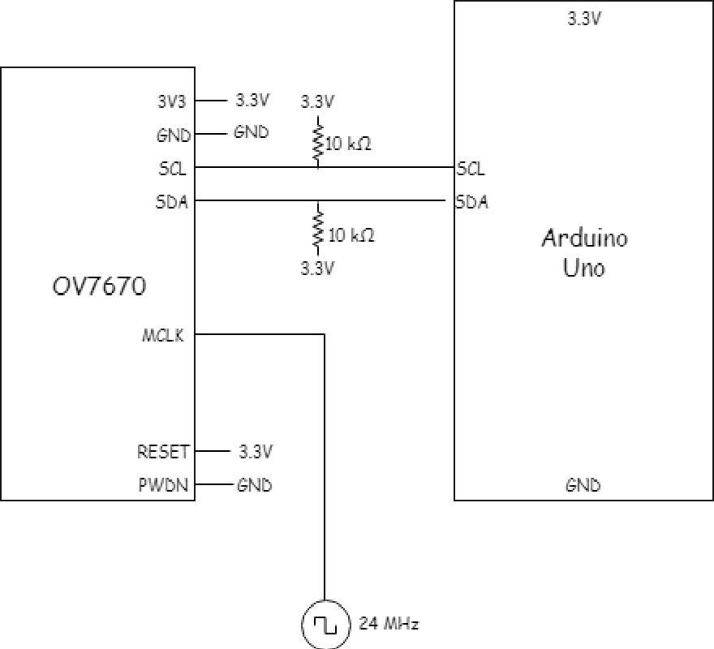
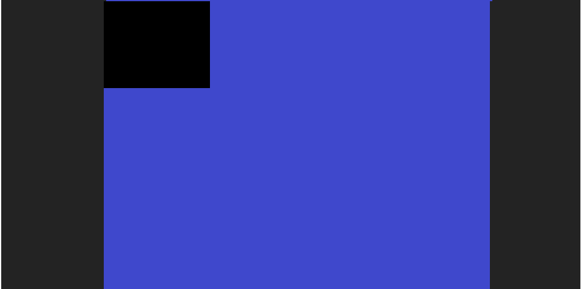

# ECE3400 Fall 2018

## LAB 4 - FPGA and Shape Detection

### Overview
 In this lab, you will split into two teams to develop an FPGA module capable of detecting basic shapes from a camera input. This device will be mounted on the robot to identify these shapes on the walls of the maze.

 Below is a block diagram of the device that will implemented. The red blocks, along with all of the interconnects will be made by you, the white ones are provided.

 

## Prelab

 The FPGA being used is the DE0-Nano (Non-SOC). Read some key portions of the DE0-nano's documentation here:

 * [DE0-Nano Specifications](http://www.terasic.com.tw/cgi-bin/page/archive.pl?Language=English&CategoryNo=165&No=593&PartNo=2 "Specs")

 * [DE0-Nano User Manual](http://www.ti.com/lit/ug/tidu737/tidu737.pdf "The Manual")

 The expansion headers on **page 18** of the manual will be particularly useful for planning GPIO from the FPGA to both the Arduino and the camera.

 To setup the OV7670 digital camera, you will need to get acquainted with its datasheet here:

 * [OV7670 Datasheet](https://www.voti.nl/docs/OV7670.pdf "Camera stuff")

 In order to perform image processing (for our object detection), it is useful to store our image data in a *memory buffer*. Given that the buffer can hold all the pixel data for exactly one image at a time, reading from it is equivalent to scanning through the pixels of the image in one frame of image output from the camera. No buffer exists onboard the OV7670, so one must be created on the DE0-Nano using its onboard **embedded memory**. This embedded memory consists of M9K memory blocks that we may configure to create a RAM. One caveat of this is that each entry in the RAM must have a size of 8 or 9 bits.

 We will use a VGA adapter to connect to a display for debugging (to ensure your image comes out properly). The adapter takes pixel data in RGB 332 format (8 bits - 3 red, 3 blue, 2 green). 

 The OV7670 camera requires being setup every time the camera is powered on. This involves setting registers in the camera, which can be done over the Arduino's I2C interface. The cam also requires the input of some clock. Lastly for inputs, it has an active-low reset pin and a power-down pin. Outputs of the camera include 8 pins for 8b data output and 3 signals for sampling: PCLK(pixel clock), HS(HREF), and VS(VSYNC).
 - HREF indicates the start (rising edge) and end (falling edge) of a row of pixels in an image.
 - VSYNC indicates the start (falling edge) and end (rising edge) of a frame of an image
 - PCLK decides the speed at which the data output is being transmitted. Its rising edge indicates a new byte is ready to read.

 ### Questions

  #### *Q1:*  
  Reviewing the FPGA's specifications, what is the maximum size of buffer that we can create in Kilobits? Given that each entry is, how many entires large can the RAM be?  

  #### *Q2:*  
  The OV7670 offers a variety of pixel formats to sample data at (see: Output Formats in "Key Specifications" table). Which of the formats available provides the most info on the base colors making up each pixel?  

  #### *Q3:*  
  Given that the input to our VGA adapter is RGB 332. How may we convert (downsize) the pixel format from *Q2* to be accepted by the VGA module.  


  #### *Q4:*  
  Now that we know the downsized space each pixel will take (from Q3), we need to know how many of them we must fit in memory. Which of the predefined resolutions that the OV7670 supports provides the max amount of pixels in an image, given the constrained max size of our buffer(from *Q1*)? What's the size of our buffer?  

  #### *Q5:*  
  Using the Register Set table on pages 10-23 of the OV7670 datasheet, find the registers you will need to set to do the following:  
  - reset all registers
  - Enable scaling
  - Use external clock as internal clock
  - Set the camera to output the resolution you specified in *Q4* and the pixel format you specified in *Q2*.(Note: The pixel format will take setting an extra register to fully specify)
  - Enable a color bar test (takes setting 2 regs, neither of them are the SCALING regs)
  - Vertical and mirror flip the output image (optional: it's not necessarily needed but could be useful)  

  **Make sure to get each register's name, address(hex), and value they will be set to (hex).**  

  #### *Q6:*  
  Take a look at the timing diagrams (Fig 5 and 6) on Page 7 (Ignore HSYNC, we don't use it). Use both diagrams to determine when we should sample our data. (Hint: We only want to sample valid bytes, and each one only once) 

## Lab
  To begin, collect an OV7670 camera and a DE0-Nano FPGA for your team. You will need to split into two teams to complete this lab, so decide which members will go into each. Team Camera will be working on setting up the OV7670 camera with the Arduino. Team FPGA will work on creating a downsampler in Verilog, and writing an image to the VGA display. Once *both* teams are done, work to combine the two and display the camera's image to the display. Once a subteam is done with their task. they may begin implementing their image processor in Verilog.

### PLL
 Each team will need a clock to run their respective devices. The camera requires a 24MHz MCLK (External clock) and the VGA module requires a 25MHz clock to drive the screen. RAM also uses read and write clocks. 

 The FPGA can generate a 50 MHz Clock called CLOCK_50, though we require slower clocks than this. Although we may divide these in logic, this approach is succeptible to clock skew and it is much more pragmatic to use a *phase-locked loop*. This will ensure that the clocks are treated in the FPGA as actual clock lines, and that they remain locked in phase, preventing skew. To use one of these, we'll use a piece *Altera* IP that comes with Quartus II.

 #### Download Template
  We first need to download the template for the Quartus II project. You can download that here:

  [Lab 4 FPGA Template](./Lab4_FPGA_Template.zip)

  Unzip this folder and put it somewhere you'll remember.

#### Open Project
  Open Quartus II on the lab computer   
  Go to *File>Open Project* and open the folder you unzipped, in there select the "DE0_NANO.qpf" project.  
  The top file is called DE0_NANO.v; this is where the FPGA team will work.  

#### To create our PLL
  1. Navigate to *Tools>IP Catalog* to bring up the IP Catalog 
  2. In the window that pops up, click *Library>Basic Functions>Clocks; PLLs and Resets>PLL*  
  3. Double click *ALTPLL*  
  4. In the pop-up, name the IP variation file whatever you'd like. Make sure you use a Verilog IP. 
  

  5. In the General Modes tab, set the device speed to *Any* and the frequency of inclk0 to *50MHz*, as below.
  

  6. In the **Inputs/Lock** tab deselect everything

  7. In the **Bandwidth/SS** tab only click the *Auto* bubble

  8. In the **Clock Switchover** tab deselct everything

  9. You can skip over to **Output Clocks** now. We'll be setting up *clk c0*, *clk c1*, and *clk c2*. 

  

  10. 
  For c0, select *Use this clock*. Also select *Enter output clock frequency* and set it to *24.0 MHz* as the Requested Setting. Make sure you set the clock duty cycle to *50%*.

  For c1, select *Use this clock*. Also select *Enter output clock frequency* and set it to *25.0 MHz* as the Requested Setting. Make sure you set the clock duty cycle to *50%*.

  For c2, select *Use this clock*. Also select Also select *Enter output clock frequency* and set it to *50.0 MHz* as the Requested Setting. We are making this clock, despite having CLOCK 50 as the reference clock, for the others to always be phase-locked to . As such, you should be sure to use this clock instead of CLOCK_50. Make sure you set the clock duty cycle to *50%*.

  11. Jump to the summary tab and select *nameyouchose*_inst.v and *nameyouchose*_bb.v. Your design should look like the block on the left of the picture below.

  

  Click **Finish**

  13. Go to *File>Open>folder_your_project_is_in*, and you should be able to open your *nameyouchose*_inst.v file. Pasting this into your top level module will allow you access to these clock signals. Remember to input 50MHz.

  You'll want to assign the 24MHz output to a GPIO pin, for the Camera team to use.

### Team Camera
 Congrats, you've been chosen to be a part of Team Camera. You will be responsible for wiring the camera properly and setting up its registers. 

 So grab the OV7670 and Arduino, get to work.

 Study and download the template Arduino code provided here:

 [Lab 4 Arduino Template](./Lab4_Arduino_Template.zip)

 In order for the provided functions to work, we need to set up the Arduino's I2C interface. This will require wiring the Arduino's SDA and SCL pins to the camera's, and setting the camera up as a slave peripheral.

#### **EXTREMELY IMPORT PART TO NEVER, EVER, FORGET**
  Everytime you start a new lab session, **BEFORE** uploading **ANY** code to your Arduino (at least including what's in the template), we must disable the internal pull-up resistors that are a part of the Arduino's I2C interface. This is because they pull the signals that set-up our camera to 5V, while our camera requires 3.3V. Sending 5V through will harm the camera. 

  To disable these:
  1. Go to *twi.c* at *C:\Program Files (x86)\Arduino\hardware\arduino\avr\libraries\Wire\src\utility*

  2. Right click the file and do *Properties>Securities>Edit*
  * Click *Users*
  * Click *Full Control*
  * Click *OK* and *Close*
  3. Open *twi.c* 
  4. Comment out the following lines
  ```C
  //activate internal pullups for twi
  digitalWrite(SDA,1);
  digitalWrite(SCL,1);
  ```
  5. Save the doc and close.

  Now you'll need to wire the Arduino to the OV7670 camera. We're more or less only wiring power and the I2C interface. All data pins will have to go into the FPGA when you integrate.

  Here's what you'll want to do:

  

 #### Writing Registers 
  Next you'll need to make use of the functions in the template code to write the values of the registers from the prelab to the values expected.
  Note that you'll need to write the slave address (in hex) found in the datasheet into the code (Define statement at the top). These addresses use the **least significant bit** to distinguish between read and write(0->Write, 1->Read). Arduino's Wire library uses different commands for read and write however, and appends that bit to the end of the address you use. You should be able to come up with the proper address (only one) to give the Arduino.

  When writing the registers, you may want to be sure that you're actually doing something by reading the registers you write after they're written. We've included a method you can write called *read_key_registers()* that will be useful for reading the values of registers and displaying them to the Serial monitor. You can make use of the *read_register_value()* function to do this. 

  Be aware, all values will be read in hex. All addresses and write values should also be denoted in hex. Be sure you specify that format in your code (eg. 0xAB).

  Lastly, you'll want to call the *set_color_matrix()* function in your code. This sets a group of registers responsible to ensuring the colors from your camera come out properly.


### Team FPGA

 Congrats, you've been chosen to be a part of Team FPGA.

 So grab the DE0-Nano and the VGA adapter, and get to work. 

 You'll be responsible for writing data into the provided Dual_Port M9K RAM and reading it out to the VGA display. 


#### Setup

  Open the Verilog project you downloaded before. Notice the *SCREEN_WIDTH* and *SCREEN_HEIGHT* defined at the top. Make sure these match the resolution you expected to get as part of your prelab. We also defined what RED, GREEN, and BLUE are as localparameters, they can be useful for writing a test pattern.

  You'll notice the Memory and VGA Driver are already created in the top-level DE0-Nano module. You'll need to put clock signals in. Recall VGA requires a 25MHz signal to output to the monitor. The Memory can use any clocks but they must be different between read and write as we **cannot** read and write from the same address at the same time. That would give us indeterminate data when reading. 

  Before continuing, you'll want to connect the VGA adapter to the FPGA's GPIO pins (GPIO_0[5] -> GPIO_0[23]). Use the FPGA's User Manual above to figure which ones these are. Notice that the VGA adapter has a pin labeled *G*, this needs to be connected to the FPGA's ground.

  The M9K RAM module will write to the memory address assigned to the *MEM_WRITE_ADDRESS* wire at the posedge of *clk_W*, if  *W_EN* is HIGH. It will also constantly read out the value of *MEM_READ_ADDRESS* to the *MEM_OUTPUT* wire at the rate of *clk_R*. This address is currently updated in the always block at the end of the module. The VGA Driver outputs the coordinates of the next pixel (*PIXEL_X*, *PIXEL_Y*) on the clock posedge. On its next clock cycle it takes the color (*PIXEL_COLOR_IN*) that corresponds to that coordinate, and displays it to the screen. 

  The *Update Read Address* block updates *MEM_READ_ADDRESS* by assuming that the pixels are stored one pixel per memory address, and that they are stored sequentially. This means a pixel at (175,0) would be stored at address 175, and pixel (0,1) at address 176 (given a screen width of 176 pixels). If you read the *VGA_DRIVER.v* module, you'll notice that the driver is configured to work for full VGA resolution (640 x 480). This means the VGA driver will output values for *PIXEL_X* and *PIXEL_Y* outside of our resolution (and thus outside of our RAM). For this reason we include a *VGA_READ*_MEM_*EN* so that only when a pixel is within the bounds of our predefined *SCREEN_WIDTH* and *SCREEN_HEIGHT*, will it output the pixel assigned to *VGA_COLOR_IN* to the VGA driver. Otherwise we output *BLUE*. 

  With nothing driving *VGA_COLOR_IN*, it'll look something like this:

  

#### Buffer Reader

  Your job is to connect the M9K RAM to the VGA Driver and write a test pattern to the contents of the memory. Some useful patterns to write are crosses (like the English flag), or linear gradients. You will then verify that your test pattern is properly output to the screen.

#### Downsampler

  The OV7670 Camera can only output 8 bits of a pixel at a time through D7 - D1. One pixel of color takes more than 8 bits (according to the resolution you chose in the prelab), thus requiring more than one clock cycle to output a pixel. Notice in the timing diagrams for the OV7670 that the camera outputs 1 pixel of data over two clock cycles - 8bits at each posedge. Missing just one of these cycles will lose some information, so you must determine when to sample the input data and update memory so that nothing is loss. Make sure you only sample when data is valid (Prelab *Q6*). Remember that although each pixel is output with 16bits from the camera, we only store 8bits per pixel (1 for each entry in our RAM), so we'll need to downsize it. You should know which pixels to strip away, and which to keep according to your prelab.


### Integrating

 Nice work. Now you'll be integrating the two portions. This will involve taking the actual data from the OV7670, saving it into memory (using the FPGA team's Downsampler), and reading it to the display. The Camera team should have set the camera to output a color bar test, so the output ought to look something like so:

 

 If it's not, the registers may be set incorrectly. If it looks somewhat resemblant of the photo, but skewed or 'negative', the downsampler is likely the culprit. If the buffer reader portion of Team FPGA's part came out fine, it's highly unlikely that the problem lies in the RAM-VGA driver-Display portion of the Verilog module.

 Once the color bar comes out well, toggle off the registers that are enabling the color bar test. Your image may need to be focused, which you can do manually by turning the camera's lens. You may also need to be sure that there is adequate lighting in the room. 

 Once your image is clear, move on to testing your image processing.

### Image Processing

 For your image processor, we have provided an IMAGE_PROCESSOR.v file, though one look into it will reveal that it's pretty much empty. You can make any object detection algorithm that you wish. You don't need over complicate this. You will need to use the pixel data saved in RAM from your camera to detect a few different colored shapes (below) that will be printed on the walls of the final maze. Feel free to edit any part of the code from previous portions of this lab if you wish, though it's not required.

 The image processor should output if it has detected a shape, and which shape/color. This output should then be sent to the Arduino, where you'll want to verify its value by outputting to the Serial monitor. 

 During the competition, your Arduino, FPGA, and camera will be mounted on your robot. It will need to send this data over radio to another Arduino that will be left at a base station to verify if a shape has been detected.

 Here are the treasures you should be able to detect:

 

